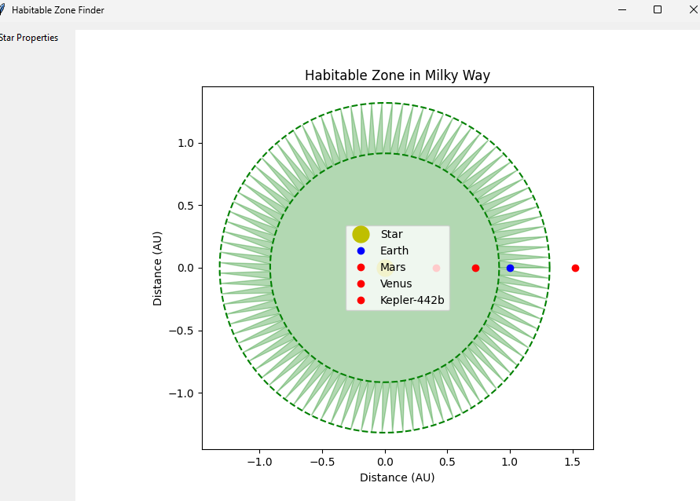

# 🌟 Habitable Zone Finder

An advanced AI-powered tool for analyzing potentially habitable exoplanets based on stellar and planetary characteristics. The application provides real-time visualization of habitable zones and planetary systems with a user-friendly GUI.



## ✨ Features

- Advanced habitability calculations based on multiple parameters
- Interactive GUI with real-time visualization
- Stellar characteristics analysis (luminosity, mass, temperature, age, activity)
- Comprehensive planetary data analysis
- Galaxy context information
- Visual representation of habitable zones
- Orbital eccentricity calculations
- Atmospheric composition consideration

## 🚀 Installation

1. Clone the repository:
```bash
git clone https://github.com/yourusername/habitable-zone-finder.git
```

Navigate to the project directory:
cd habitable-zone-finder

Create a virtual environment:
python -m venv venv

Install required packages:
pip install numpy matplotlib tkinter

Run the application:
python main.py

Data Input Format
Star Properties

Luminosity (solar units)
Mass (solar masses)
Temperature (Kelvin)

Age (billion years)
Activity level (0-1 scale)
Galaxy name

Planet Properties
Name

Orbital distance (AU)
Radius (Earth radii)
Mass (Earth masses)

Atmospheric composition
Surface gravity (m/s²)
Orbital eccentricity

🎯 Example Output
The visualization shows:

Green zone: Habitable region
Yellow dot: Central star
Blue dots: Potentially habitable planets

Red dots: Non-habitable planets

🛠️ Technical Details
The habitability calculation considers:

Conservative habitable zone boundaries
Stellar age and activity effects
Orbital eccentricity

Atmospheric presence
Planet mass constraints
Surface gravity requirements
